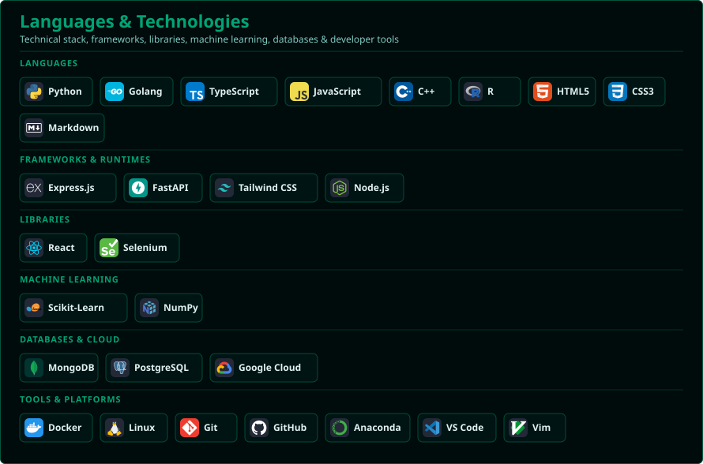

<h1 align="center">Hi 👋, I'm Vedant Chaudhari</h1>
<h3 align="center">A Full-Stack Developer from Pune, India</h3>

- 🤓 I'd like to hear about AI-ML and Production Systems
  
- 💪 I like to design Robust, Resilient and Scalable Systems

- 🔭 I’m currently working on [cloudvitta](https://github.com/thatengineerguy21/cloudvitta) [Jal-Sanket-Kendra](https://github.com/thatengineerguy21/Jal-Sanket-Kendra)

- 📫 Here is my Mail Address **vedantchaudhari.work@gmail.com**

- 🌐 Check out my Portfolio at [thatengineerguy.in](https://thatengineerguy.in)

<h3 align="left">Connect with me:</h3>

<!--  -->

  

  

